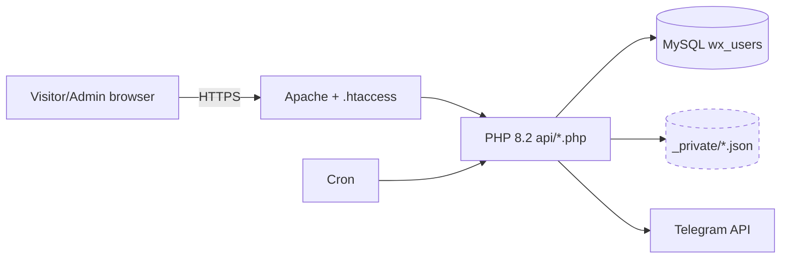

# Technology and Architecture Map

## Detected stack (evidence in brackets)
| Layer | Detected | Confidence | Evidence |
|---|---|---|---|
| Backend | PHP 8.2 (`php:8.2-apache` image; `declare(strict_types=1)`) | Detected | `Dockerfile:1`; `api/admin.php:10` |
| Web server | Apache with `.htaccess` (`mod_rewrite`, `headers`) | Detected | `Dockerfile:4`; `.htaccess` |
| Dev server | `php -S` router (`router.php`) | Detected; dev-only | `router.php` |
| Frontend | Vanilla JavaScript (IIFE modules), hash routing, no bundler | Detected | `admin/*.js`, `admin/index.html` (69 script tags) |
| Charts | Chart.js | Detected | `admin.js:529–537`, `admin-dash.js:177` |
| PDF | html2pdf bundle (vendor) | Detected | `admin/vendor/html2pdf.bundle.min.js` |
| Database | MySQL (`wx_users`), with JSON file fallback under `_private/` | Detected | `api/admin.php:57`, `_private/*.json` |
| Hosting target | Hostinger (shared), Render (`render.yaml`), Docker | Probable | `HOSTINGER-DEPLOYMENT-GUIDE.md`; `render.yaml`; `Dockerfile` |
| Integrations | Telegram Bot API, WhatsApp (`p18g-lib.php`, `wahub-lib.php`), Google data (`google-data-lib.php`), Sheets | Detected (code); live behaviour unknown | `api/*-lib.php` |
| Automation | Cron (`api/wa-cron.php`, keyed), polling loops in admin JS | Detected | `wa-cron.php:14`; `admin-chat2.js:137` |
| Tests | jsdom harness (`tools/qa-p29/harness.js`), php-parser lint, re-verification and regression scripts | Detected (this audit) | `tools/qa-p29/`; `woodex-audit/evidence/scripts/` |
| Netlify (other projects) | Netlify functions with Supabase | Detected (other trees) | `netlify/functions/*.mjs` |

## Entry points and trust boundaries
```
Browser ──► /admin/index.html ──(69 scripts, no ?v=)──► admin.js (router, api())
   │                                                       │
   │  POST /api/admin.php?action=…   (dispatcher, catch PDOException only)
   │        ├─ admin.php   (auth, users, settings, integrations status)
   │        ├─ dash-lib / sales-lib / content-lib / … (12 libs, no try/catch)
   │        ├─ builder.php (page builder; token from shared secret)
   │        └─ wa-cron.php (cron key) ─► p18g-lib (WhatsApp, lock wa-auto.lock)
   │
   ├─ /estimator/index.html (public form)
   ├─ /downloads.html (public; contains sign-in hint — SEC-002)
   └─ /_private/*.json, /_database/*.sql  ← must be denied by .htaccess only (AD-25)

Data:  MySQL wx_users  |  _private/*.json (non-atomic writes, AD-21)  |  SQL dumps (tracked)
External: Telegram Bot API (token in client JS — SEC-003), WhatsApp, Google
```

## Route registry (admin)
- NAV table: `admin.js:83` (approvals entry), no `phase` field (AD-03).
- View registry: `VIEWS` object. **20 keys have 2+ definers** (AD-12). Last script wins (`index.html` script order).
- Aliases (`integrations`, `business`, `connections`) in `admin-settings.js:586–588`, not in NAV (AD-04).

## Authentication and roles
- Login: `api/admin.php:364` `password_verify()` against `wx_users.pass_hash` (bcrypt). Failed attempts throttled (`throttle(true)`).
- Session: HMAC-signed token from `bsecret()` (AD-21 regeneration risk).
- Builder: separate builder password (`password_verify`, `admin.php:319`) and signed builder token (`builder.php:60–81`).
- Roles: `owner`, `admin`, `editor`, `support`, `sales` (`dash-lib.php` role routing; `admin-appr.js:130–135`).
- Tenant boundaries: single tenant. No tenant model found in the P29 code.

## Mermaid overview (deployment, probable)

The dashed store is the one whose public reachability depends on `.htaccess` being honoured (AD-25).

## Unresolved architecture questions
1. Live topology (which host serves which tree) — unknown.
2. Whether `router.php` is ever used in production (documented as dev-only in `15`).
3. Whether the MySQL database is local to the host or remote.
